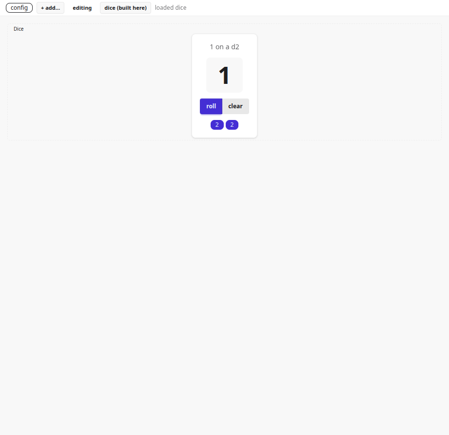

# dyncomp-dice — a universal host, and a guest to load into it

One of [`examples/`](../README.md): a project that uses tutuca the way somebody
outside the repository would. This one covers the dynamic-component seam.

A page you drop a WebAssembly component on. It unpacks the archive in the
browser, reads what the component declared, adds it to a searchable catalog,
generates a configuration form for it, and mounts it — with no rebuild of the
page and no trust extended to the code inside.

Every line of the machinery comes from `moon add marianoguerra/tutuca`. There is
no path dependency here, no `../`, and nothing that runs a script from the
repository this directory happens to sit in. That constraint is the point: this
example exists to demonstrate that the dynamic-component half of tutuca is
usable by somebody who has only the published package.

It ships one component of its own — a die — so the demonstration goes all the
way through: writing a guest, building it, packing it, loading it, and using it.



## Prerequisites

| tool | version | why |
| --- | --- | --- |
| `moon` | 0.10.x | builds both modules; brings `moon-wasm-opt` |
| `wasm-tools` | 1.244.x | turns the guest into a Component-Model component |
| Node | ≥ 20 | the build scripts, and `jco` for the ESM the browser loads |
| Chrome or Edge | current | the page needs the JS String Builtins proposal; Firefox cannot load it yet |

These three are version-coupled. Bumping one without the others can produce a
component the host refuses.

Network is needed the first time, to fetch the dependencies. If resolution picks
something older than the version `moon.mod` pins, run `moon update` — `dyncomp/`
was excluded from the package until 0.9.5, so anything before that resolves to a
tutuca with none of this in it.

## Build and run

```sh
node build.mjs
python3 -m http.server 8099 -d dist
```

Then open <http://localhost:8099/>.

```
node build.mjs --skip-guest    # the page only — the fast loop while editing it
node build.mjs --skip-npm      # assume dice/node_modules is already there
```

## Walk through it

1. The page opens as one empty cell with a `+`.
2. Click **dice (built here)** in the bar. The status line says `loaded dice`:
   the archive has been fetched, gunzipped, untarred and instantiated, and
   everything its manifest declared is now in the catalog.
3. Click the `+`. The catalog lists the standard components — Stack, Grid,
   Tabs, Text — and, at the bottom, **Dice**, tagged with the module it came
   from and the description written in `dice.mbt`.
4. Pick it. A configuration form appears that nobody wrote: `faces` with its
   `2…100` bounds, `last`, `rolls` as JSON, each with its own documentation,
   plus the named starting state **d20**. All of that is projected from the
   component's *declared* schema — the host has not looked inside its state and
   could not if it wanted to.
5. Place it, and click **roll**.

That last click is the one worth watching. Open the console first:

```
host: rolled 4 on a d6
```

The die did not produce that number. It could not: its world imports no WASI —
no clock, no entropy, nothing ambient — so a die living inside it has no way to
make the one thing it exists to make. It asked, through
`control.request "roll"`, and `page/main.mbt` answered. That console line is a
sandboxed component reaching a service the page chose to lend it, and it is the
whole seam in one line.

Then: roll until a maximum comes up and a badge appears (a view method and a
`@when` filter, evaluated by the host over a list field it reads one item at a
time). Change `faces` in the form and apply it — that goes through a `setFaces`
mutator nobody declared, which the host synthesized from the declared field.

## What proves what

| file | what it demonstrates |
| --- | --- |
| `moon.mod` | two published dependencies, no path dependency. Everything below is reachable from a tarball. |
| `page/moon.pkg` | the wasm-gc export list — the ONE thing that cannot come from a dependency, and therefore the only reason the page is a package rather than a function call |
| `page/main.mbt` | the whole host in ~70 lines: `@uiw.mount`, six one-line forwards, the `roll` service, and the `policy` this page grants a bundle (nothing) |
| `page/loader.mjs` | the browser side: three import namespaces, all from the published loaders |
| `dice/gen/interface/tutuca/component/guest/dice.mbt` | the ONE file a component author writes. Everything else under `dice/` came from `tutuca new-guest dice`. |
| `build.mjs` | the assembly, including the loader rewrite below |

`dice/` is a **separate module** with its own `moon.mod`, because a
`tutuca:component` guest is not a MoonBit dependency of anything — it is a
WebAssembly component that meets the host across the Component Model. Diff it
against a fresh `tutuca new-guest dice` and only `dice.mbt` differs.

## The one piece of wiring worth knowing about

A wasm-gc module cannot reach the DOM, so two JavaScript files come down with
the package and have to be served beside the page:

- `app/wasm/loader.mjs` — `jscore`, `tdom` and `instantiate`. Every wasm-gc
  tutuca page needs this one.
- `dyncomp/host/wasm/loader.mjs` — `tcomp` (the guest bridge, the value arena,
  the archive unpacker) and `tkv` (localStorage). Only a page that loads bundles
  links it, through `instantiate`'s `makeExtra` hook.

The second imports the first by a relative path that is correct where they live
inside the package and wrong once they land flat beside a page, so `build.mjs`
repoints it — and fails loudly if the string it is looking for is not there,
because a rewrite that silently matches nothing yields a broken page from a
green build. The published documentation shows these as bare specifiers, which
no browser can resolve; step 8 of `build.mjs` is the concrete answer.

## Editing

Change `dice/gen/interface/tutuca/component/guest/dice.mbt`, run
`node build.mjs --skip-npm`, reload. Views are template strings in the manifest,
so a change to one needs no host rebuild — only a repack and a reload.

`dice/node_modules` is deliberately its own copy rather than a workspace:
`dice/build.mjs` resolves `jco` against its own directory, which is what lets a
scaffolded guest be moved anywhere and still build.

## Further reading

- [Dynamic components](https://github.com/marianoguerra/tutuca-moonbit/blob/main/docs/dynamic-components.md)
  — how to host them, and `tutuca new-guest` to write one
- [The design](https://github.com/marianoguerra/tutuca-moonbit/blob/main/dyncomp/DESIGN.md)
  — the contract and how it maps onto tutuca
- [What a bundle can and cannot do](https://github.com/marianoguerra/tutuca-moonbit/blob/main/dyncomp/SECURITY.md)
